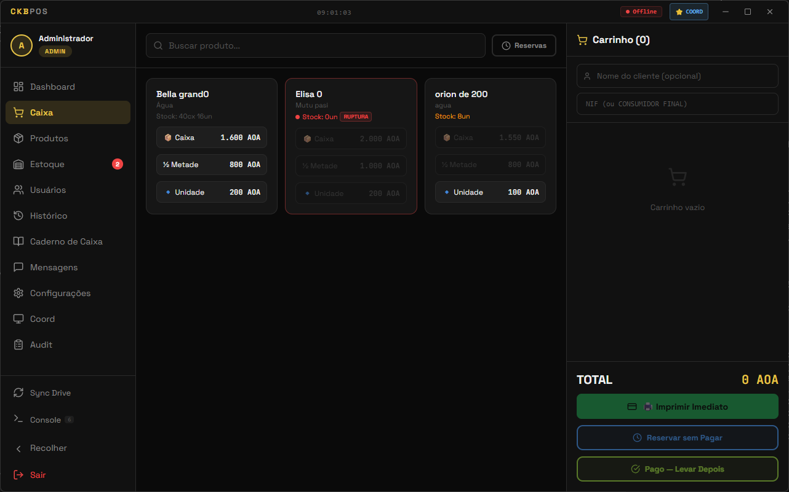
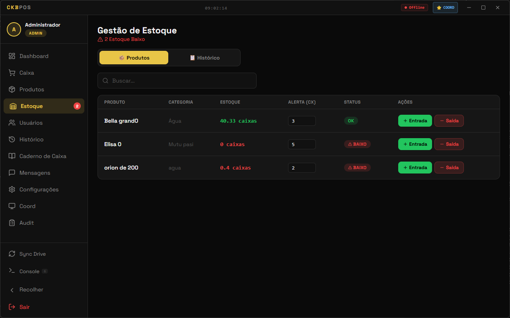
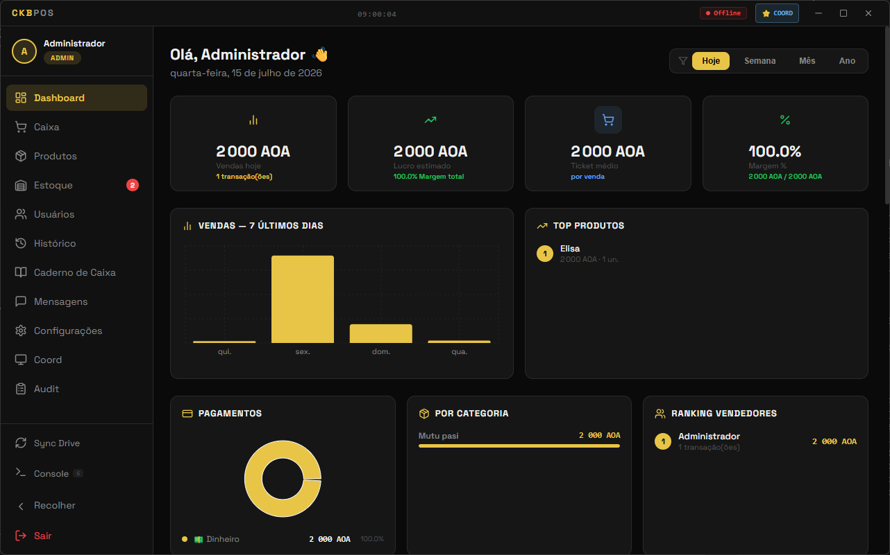
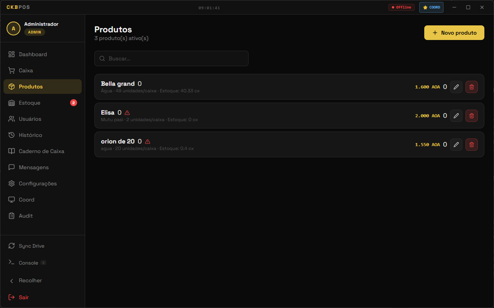
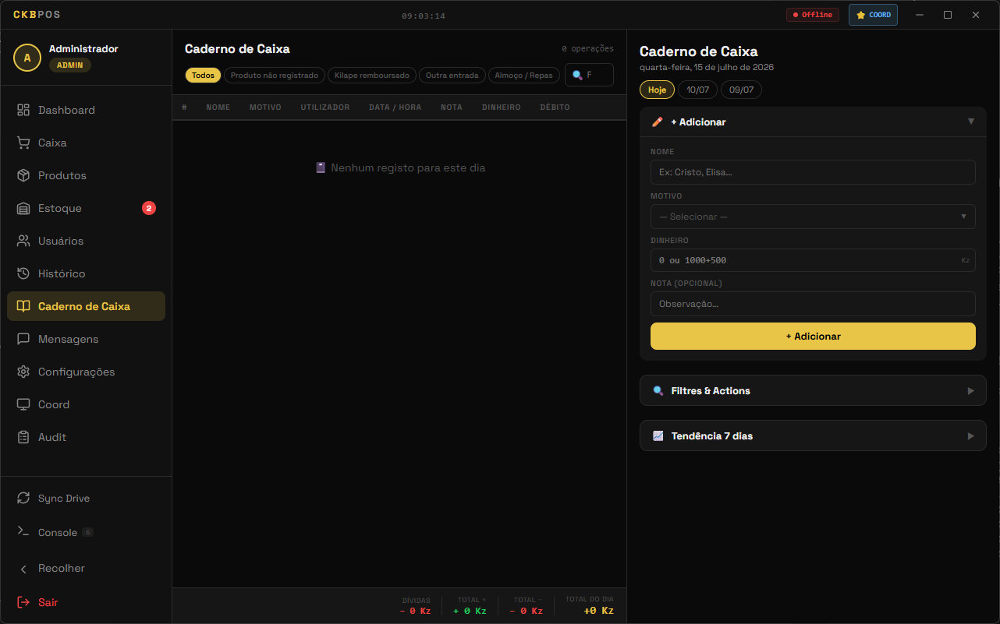

<h1 align="center">
   CKBPOS
</h1>

<p align="center">
  <a href="https://github.com/lpourmoment-dot/CKBPOS/stargazers"></a>
  <a href="https://github.com/lpourmoment-dot/CKBPOS/releases"></a>
  
  
  
</p>

<p align="center">
  <strong>Application de point de vente professionnelle pour commerces en Angola.</strong><br/>
  Gestion de stock, caisse tactile, comptabilite, synchronisation multi-machines, et conformite fiscale AGT.
</p>

<p align="center">
  <a href="https://github.com/lpourmoment-dot/CKBPOS/releases/latest/download/CKBPOS-Setup-5.0.9.exe"><ins>Telecharger CKBPOS</ins></a>
</p>

<p align="center">
  
</p>

---

## Fonctionnalites

<table>
<tr>
<td width="50%" valign="middle">

### Caisse Tactile

Interface de vente intuitive avec panier, calcul de monnaie, paiement mixte (Numerario + App Express), et impression thermique 72mm.

</td>
<td width="50%">


</td>
</tr>
<tr>
<td width="50%" valign="middle">

### Gestion de Stock

Stock en temps reel avec alertes de rupture, gestion par carton/demi/unite, scan code-barres et QR code.

</td>
<td width="50%">



</td>
</tr>
<tr>
<td width="50%" valign="middle">

### Dashboard & Rapports

Vue d'ensemble des ventes, top produits, tendances, et graphiques interactifs pour admin et vendeur.

</td>
<td width="50%">



</td>
</tr>
<tr>
<td width="50%" valign="middle">

### Gestion Produits

Catalogue produits avec variants, categories, codes-barres, et gestion des prix par carton/demi/unite.

</td>
<td width="50%">



</td>
</tr>
<tr>
<td width="50%" valign="middle">

### Caderno (Registre)

Carnet de entries/sorties avec graphiques, exports Excel, impression, et gestion des dettes.

</td>
<td width="50%">



</td>
</tr>
</table>

**Aussi inclus :**
- **Multi-machines** — Synchronisation cloud temps reel via Supabase, messagerie inter-machines
- **3 langues** — Portugais, Francais, Anglais
- **Theme dark/light** — Interface adaptable
- **Console SQL** — Requetes directes depuis l'app
- **Journal d'audit** — Traçabilité complete
- **Auto-update** — Mises a jour automatiques via GitHub
- **Systeme de Licence** — Activation par fichier .ckb ou Supabase Realtime

---

## Editions

| Edition | Description | Prix |
|---------|-------------|------|
| **CKBPOS** | Point de vente standard | Libre / Licence |
| **CKBPOS-PRO** | + Conformite fiscale AGT, facturation fiscale, notes de credit | Licence |
| **CKBPOS-ADMIN** | Gestion des licences (outil interne) | Non distribue |

---

## Installation

### Windows (.exe)

- **[Telecharger la derniere version](https://github.com/lpourmoment-dot/CKBPOS/releases/latest)**
- Ou via winget :
```powershell
winget install lpourmoment-dot.ckbpos
```

### Depuis la source

```bash
git clone https://github.com/lpourmoment-dot/CKBPOS.git
cd CKBPOS
npm install
npm run dev
```

**Compte admin par defaut :**
- Email : `admin@ckbpos.com`
- Mot de passe : `admin123`

> Changez le mot de passe immediatement apres la premiere connexion !

---

## Structure du projet

```
CKBPOS/
├── main.js                    # Electron main process
├── preload.js                 # IPC bridge
├── licensing.js               # Validation licence
├── src/
│   ├── App.js                 # Routes + contextes
│   ├── pages/
│   │   ├── CaissePage.js      # Caisse tactile
│   │   ├── DashboardPage.js   # Tableau de bord
│   │   ├── ProductsPage.js    # Gestion produits
│   │   ├── EstoquePage.js     # Gestion stock
│   │   ├── CadernoPage.js     # Registre
│   │   ├── HistoriquePage.js  # Historique ventes
│   │   ├── UsersPage.js       # Gestion utilisateurs
│   │   ├── MessagingPage.js   # Messagerie
│   │   ├── SettingsPage.js    # Parametres
│   │   └── LicensePage.js     # Licence
│   ├── components/
│   │   ├── Layout.js          # Sidebar + navigation
│   │   ├── ShiftModal.js      # Ouverture/fermeture caisse
│   │   └── AlertModal.js      # Modales
│   └── utils/
│       └── useLang.js         # Internationalisation
├── database/
│   └── db.js                  # SQLite schema + migrations
├── CKBPOS-Mobile/             # App mobile (Expo)
├── scripts/
│   ├── verify-build.js        # Verification pre-build
│   └── update-winget.ps1      # Mise a jour manifest winget
└── winget-manifest/           # Manifest winget
```

---

## Stack technique

| Technologie | Role |
|------------|------|
| **Electron 41** | Desktop framework |
| **React 18** | Interface utilisateur |
| **SQLite** (better-sqlite3) | Base de donnees locale |
| **Supabase** | Sync cloud temps reel |
| **WebSocket** | Communication LAN |
| **Expo** (React Native) | App mobile |
| **Recharts** | Graphiques |
| **Lucide** | Icones |

---

## Configuration reseau

1. Aller dans **Parametres > Reseau**
2. Activer le mode **Coordinateur** sur une machine
3. Les autres machines se connectent automatiquement
4. La messagerie inter-machines est disponible immediatement

---

## Support & Communaute

- **GitHub Issues** : [Signaler un bug](https://github.com/lpourmoment-dot/CKBPOS/issues)
- **WhatsApp** : Contactez le support via l'app (Parametres > Support)

---

## Versions recentes

| Version | Ajouts |
|---------|--------|
| **5.0.9** | Fix stock precision, caderno redesign, README professionnel, winget manifest |
| **5.0.8** | Fix stock flottant, caderno redesign, transfert features vers PRO |
| **5.0.0** | Systeme de licence complet, auto-update |
| **4.9.0** | Console SQL, theme light |
| **4.1.0** | Messagerie inter-machines |
| **3.9.0** | QR code produits, caderno |
| **3.5.0** | Dashboard coordinateur, audit |

---

## Licence

CKBPOS est une application proprietaire. Voir le fichier LICENSE pour les details.
